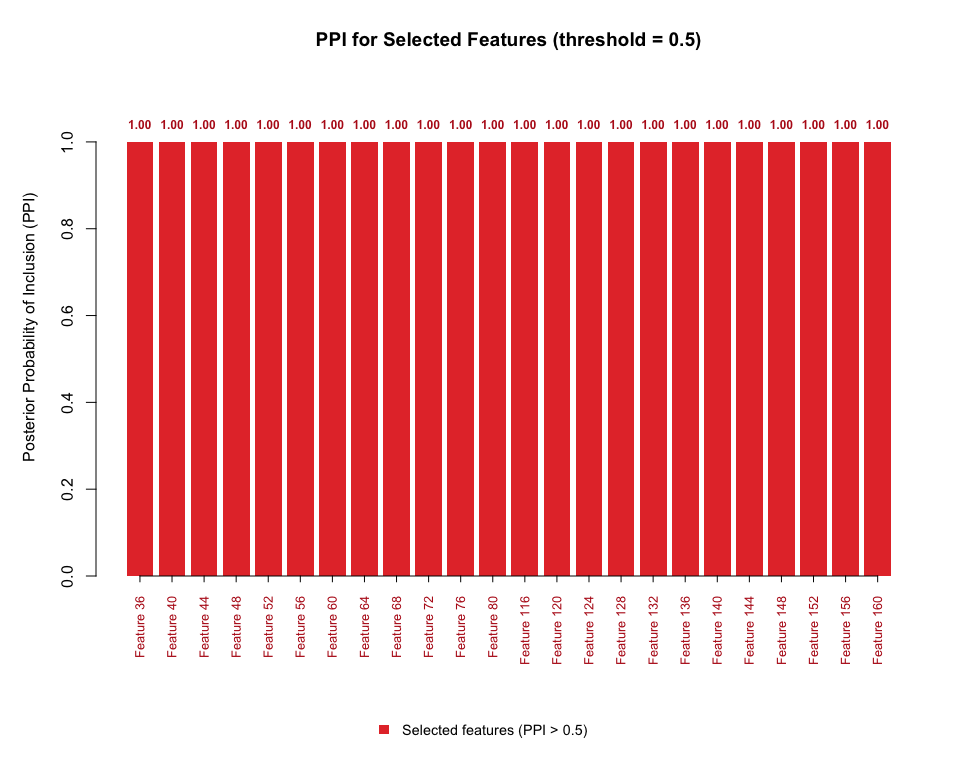
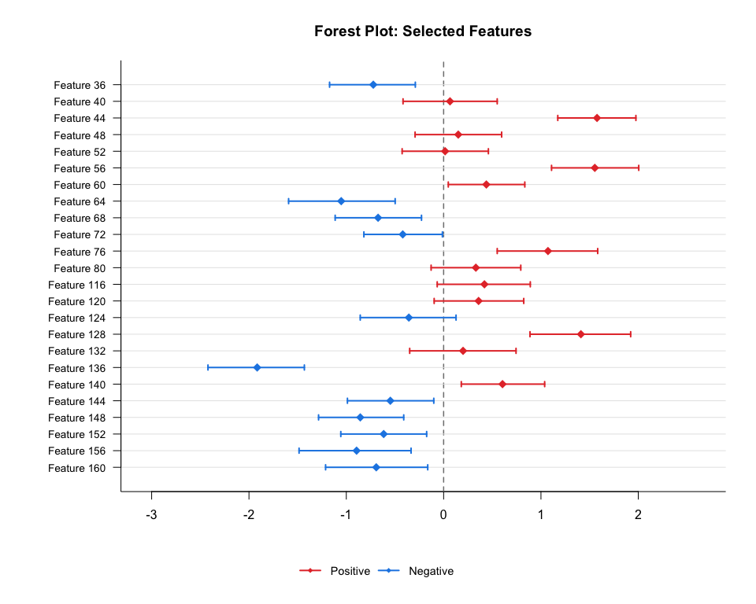
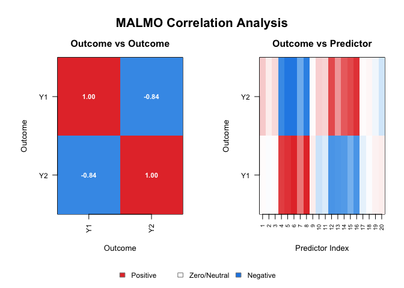
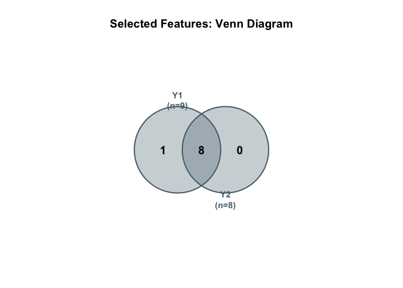
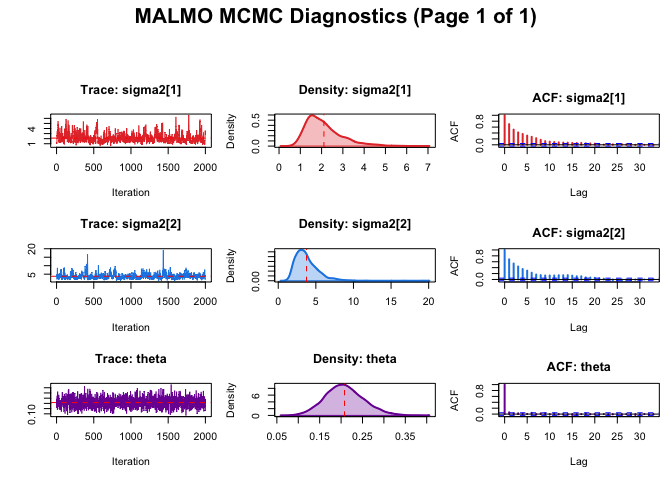

# BaMMI: Bayesian Microbiome-Metabolite Integration

BaMMI is an R package for Bayesian microbiome-metabolite data
integration. It provides two models:

1.  **BSRMM** - Bayesian sparse regression for microbiome-metabolite
    data integration for univariate metabolite outcomes.
2.  **MALMO** - Microbiome association with left-censored and missing
    metabolic outputs for multivariate metabolite outcomes.

## Installation

You can install the development version of BaMMI from GitHub with:

``` r
# install.packages("devtools")
devtools::install_github("Kai-Jiang-1/BaMMI")
```

## BSRMM

### Data Simulation

``` r
library(BaMMI)

set.seed(123)
mydata <- gen_missing_value(
  n          = 100,
  p          = 200,
  snr        = 1,
  proportion = 0.30,
  type       = "mnar0.33"
)

cat("True features:", which(mydata$coeffs[,1] != 0), "\n")
#> True features: 36 40 44 48 52 56 60 64 68 72 76 80 116 120 124 128 132 136 140 144 148 152 156 160
cat("Missing proportion:", mean(mydata$Y_miss == 0), "(1/3 MNAR + 2/3 MAR)\n")
#> Missing proportion: 0.3 (1/3 MNAR + 2/3 MAR)
```

### Run BSRMM Gibbs Sampler

``` r
## Prepare inputs
predictor <- mydata$X
outcome   <- mydata$Y_miss

## Standardize predictors
stand     <- list()
stand$mux <- colMeans(predictor)
stand$Sx  <- apply(predictor, 2, sd)
predictor <- apply(predictor, 2, function(x) (x - mean(x)) / sd(x))

## Train/test split
set.seed(33)
train_ind <- sort(sample(nrow(predictor),
                   size    = round(0.7 * nrow(predictor)),
                   replace = FALSE))

X <- as.matrix(predictor[train_ind, ])
Y <- as.matrix(outcome[train_ind, ])
n <- nrow(X); p <- ncol(X); c <- 100
N <- rbind(diag(p), matrix(c, 1, p))
Q <- mydata$Q; a <- rep(-12, p)
nop <- floor(n / 2)

## Run Gibbs sampler
bsrmm <- bsrmmgibbs(
  nburnin = 10000,
  niter   = 20000,
  p = p, nop = nop,
  Y = Y, X = X, N = N,
  a = a, Q = Q, n = n
)

## Posterior probabilities of inclusion
PPI      <- colMeans(bsrmm$gamma[(10000+2):(10000+20000+1), ])
selected <- which(PPI > 0.5)
cat("Selected features:", selected, "\n")
#> Selected features: 36 40 44 48 52 56 60 64 68 72 76 80 116 120 124 128 132 136 140 144 148 152 156 160

## Table of true vs selected features
table(
  True = ifelse(1:p %in% which(mydata$coeffs[,1] != 0), "Yes", "No"),
  Selected = ifelse(1:p %in% selected, "Yes", "No")
)
#>      Selected
#> True   No Yes
#>   No  176   0
#>   Yes   0  24
```

### Visualization

``` r
## PPI plot
bsrmm_ppi(bsrmm, nburnin = 10000, niter = 20000)
```



    #> === PPI Summary ===
    #> Total features    : 200
    #> Selected features : 24
    #> Selected indices  : 36, 40, 44, 48, 52, 56, 60, 64, 68, 72, 76, 80, 116, 120, 124, 128, 132, 136, 140, 144, 148, 152, 156, 160

    ## Forest plot
    bsrmm_forest(bsrmm, nburnin = 10000, niter = 20000, stand = stand)



``` r

## MCMC diagnostics (multiple chains)
chain1 <- bsrmmgibbs(nburnin=10000, niter=20000, p=p, nop=nop,
                     Y=Y, X=X, N=N, a=a, Q=Q, n=n)
chain2 <- bsrmmgibbs(nburnin=10000, niter=20000, p=p, nop=nop,
                     Y=Y, X=X, N=N, a=a, Q=Q, n=n)
chain3 <- bsrmmgibbs(nburnin=10000, niter=20000, p=p, nop=nop,
                     Y=Y, X=X, N=N, a=a, Q=Q, n=n)
chain4 <- bsrmmgibbs(nburnin=10000, niter=20000, p=p, nop=nop,
                     Y=Y, X=X, N=N, a=a, Q=Q, n=n)
bsrmm_diagnostic(list(chain1, chain2, chain3, chain4), nburnin=10000, niter=20000)
#> === MCMC Diagnostics ===
#> Number of chains  : 4
#> Burn-in           : 10000
#> Iterations        : 20000
#> Selected features : 36, 40, 44, 48, 52, 56, 60, 64, 68, 72, 76, 80, 116, 120, 124, 128, 132, 136, 140, 144, 148, 152, 156, 160
#> === Rhat Summary ===
#> Rhat sigma2 : 1.000 [OK]
#> Rhat theta  : 1.000 [OK]
#> Rhat beta:
#>   beta_36     : 1.000 [OK]
#>   beta_40     : 1.000 [OK]
#>   beta_44     : 1.000 [OK]
#>   beta_48     : 1.000 [OK]
#>   beta_52     : 1.000 [OK]
#>   beta_56     : 1.000 [OK]
#>   beta_60     : 1.000 [OK]
#>   beta_64     : 1.000 [OK]
#>   beta_68     : 1.001 [OK]
#>   beta_72     : 1.000 [OK]
#>   beta_76     : 1.000 [OK]
#>   beta_80     : 1.000 [OK]
#>   beta_116    : 1.000 [OK]
#>   beta_120    : 1.000 [OK]
#>   beta_124    : 1.001 [OK]
#>   beta_128    : 1.000 [OK]
#>   beta_132    : 1.000 [OK]
#>   beta_136    : 1.000 [OK]
#>   beta_140    : 1.000 [OK]
#>   beta_144    : 1.000 [OK]
#>   beta_148    : 1.000 [OK]
#>   beta_152    : 1.001 [OK]
#>   beta_156    : 1.000 [OK]
#>   beta_160    : 1.000 [OK]
#> 
#> === ESS Summary ===
#> ESS sigma2 : 20986.6
#> ESS theta  : 52502.1
```

## MALMO

> **Note:** Since MALMO is computationally expensive, we also provide
> MATLAB code at <https://github.com/Kai-Jiang-1/MALMO>. We recommend
> running the MALMO model under a high performance computing environment
> for large datasets, for both the R package and MATLAB code. Here, we
> use a relatively small sample size to illustrate the model.

### Data Simulation

``` r
set.seed(123)
mydata_mv <- gen_missing_value_mv(
  n          = 50,
  p          = 20,
  q          = 2,
  snr        = 1,
  proportion = 0.30,
  type       = "mnar0.33"
)
#> Missing proportion: 0.300 (target: 0.300)

cat("True features:", mydata_mv$p_true, "\n")
#> True features: 4 5 6 7 8 12 13 14 15 16
```

### Run MALMO Gibbs Sampler

``` r
result <- malmo_gibbs(
  Y       = mydata_mv$Y_miss,
  X       = mydata_mv$X,
  nburn   = 1000,
  niter   = 2000,
  display = FALSE
)

## Summarize C matrix
C_summary <- malmo_summarize(
  result$C_result,
  nburn = 1000,
  niter = 2000
)

## Selected features
selected <- which(rowSums(abs(C_summary$mean)) > 0)
cat("Selected features:", selected, "\n")
#> Selected features: 4 5 6 7 8 12 13 14 16
cat("True features:", mydata_mv$p_true, "\n")
#> True features: 4 5 6 7 8 12 13 14 15 16

## Table of true vs selected features
table(True = ifelse(1:nrow(C_summary$mean) %in% mydata_mv$p_true, "Yes", "No"),
      Selected = ifelse(1:nrow(C_summary$mean) %in% selected, "Yes", "No"))
#>      Selected
#> True  No Yes
#>   No  10   0
#>   Yes  1   9
```

### Visualization

``` r
## Correlation heatmaps
malmo_plot_correlation(Y = mydata_mv$Y_true, X = mydata_mv$X)
```



    #> === Correlation Summary ===
    #> Outcomes    : 2
    #> Predictors  : 20
    #> 
    #> Outcome correlation matrix:
    #>        [,1]   [,2]
    #> [1,]  1.000 -0.835
    #> [2,] -0.835  1.000
    #> 
    #> Max |cor(Y, X)| : 0.749
    #> Mean |cor(Y, X)|: 0.322

    ## Venn/UpSet diagram
    malmo_plot_venn(C_summary)



    #> === Selection Summary ===
    #> Y1 : 9 selected features
    #> Y2 : 8 selected features
    #> Union        : 9 features
    #> Intersection : 8 features

    ## MCMC diagnostics
    malmo_diagnostic(result, nburn = 1000, niter = 2000)



    #> === MALMO MCMC Diagnostics ===
    #> Iterations used : 2000
    #> 
    #> sigma2[1] - ESS:  235.6 | Geweke z:  1.655 [OK]
    #> sigma2[2] - ESS:  257.9 | Geweke z: -0.225 [OK]
    #> theta     - ESS: 1773.1 | Geweke z:  0.677 [OK]
    #> 
    #> Convergence guide:
    #>   ESS > 100    : acceptable
    #>   ESS > 1000   : good
    #>   |Geweke| < 2 : converged [OK]
    #>   |Geweke| > 2 : not converged [WARNING]

## Contact

- **Author**: Kai Jiang
- **Email**: <Kai.Jiang@uth.tmc.edu>
- **GitHub**: <https://github.com/Kai-Jiang-1/BaMMI>
- **Institution**: UTHealth Houston
